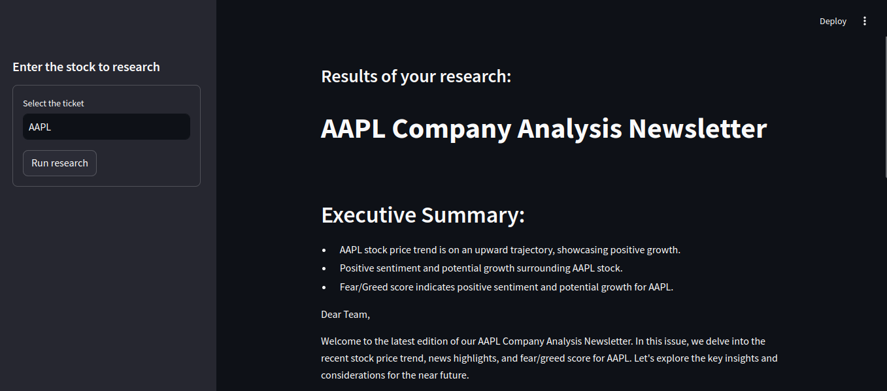

## AI stock evaluation agent

[](https://www.python.org/)
[](https://pypi.org/project/yfinance)
[](https://streamlit.io/)
[](https://www.langchain.com/)
[](https://www.crewai.com/)
[](https://platform.openai.com/docs/overview)

### summary

- [About the project](#about-the-project)
- [Agents](#it-has-three-main-agents)
- [Code structure](#code-structure)
- [Install dependencies](#install-dependencies)
- [Generate python code](#convert-jupyter-notebook-code-to-python-code)
- [Run project](#run-project)

---

### About the project:
This project is a stock analysis tool that leverages various APIs and intelligent agents to conduct in-depth research on stock market performance. The system is built in Python and uses libraries such as yfinance, Streamlit, and langchain, among others.



### It has three main agents:

**Stock Price Analysis**: Fetches historical stock price data for one year and analyzes current trends (up, down, or sideways).

**News Analysis**: Searches for the latest news related to the stocks, analyzes market trends, and assigns a "fear/greed" score based on the gathered information.

**Report Generation**: Combines the stock price analysis and news research to create a detailed report and a three-paragraph newsletter, highlighting key points and offering future trend predictions.

The results are presented to the user through an interactive web interface, where they can input the stock ticker and view the complete analysis.

---

This template can be easily adapted to other scenarios by changing the project description and code details while maintaining the structure and clear, accessible tone.

### Code structure
```
|-- assets
|-- jupyter
|   |-- crewai-stocks.ipynb -> jupyter notebook file to development
|-- .gitignore
|-- crewai-stocks.py -> Final file after development
|-- readme.md
|-- requirements.txt -> Dependencies required for the project
```

### Install dependencies
```bash
pip install -r requirements.txt
```

### Convert jupyter-notebook code to python code
```bash
jupyter nbconvert --to script jupyter/crewai-stocks.ipynb
```

### Run project
```bash
streamlit run crewai-stocks.py
```
